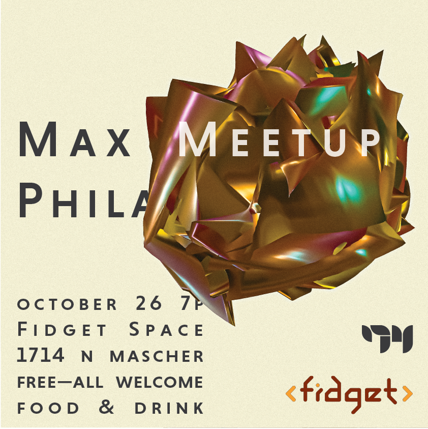

# Max Meetup — Philadelphia 
## October 26, 2023
### 7pm ET
## Fidget Space
### 1714 N. Mascher Street 
### Philadelphia, PA 19122
 
## RSVP Required
 
Max Meetup Philadelphia is a regular meeting to share ideas and strengthen the connections of the Philadelphia community of Max users, digital artists and musicians. Each meetup will feature workshops, conversations, and open work-shares focusing on art-making, Max, and digital technologies. All experience levels are welcome to attend. Attendees are encouraged to bring their computers if they wish to patch along with the workshops.

The October meetup will feature a workshop by [Sam Wells](https://sllewm.as) that focuses on several of the new features in Max 8.3 with an eye towards step-sequencing and audio reactive visuals.

This event is free and open to the public, food and drink will be provided by Cycling ’74.

Max Meetup Philadelphia is organized by Sam Wells, a musician, video artist, and Max Certified Trainer based in Philadelphia.

Support provided by Fidget and Cycling ’74.

